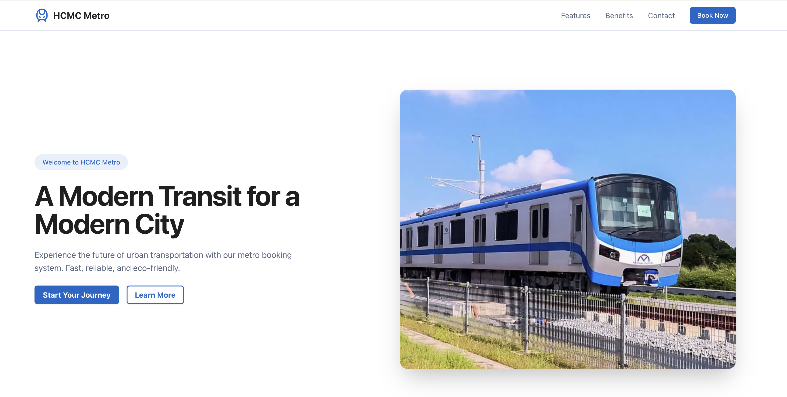
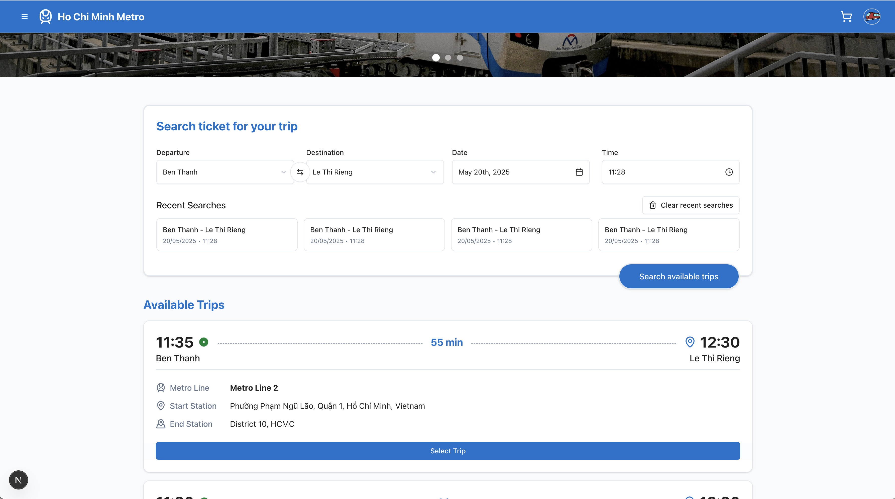
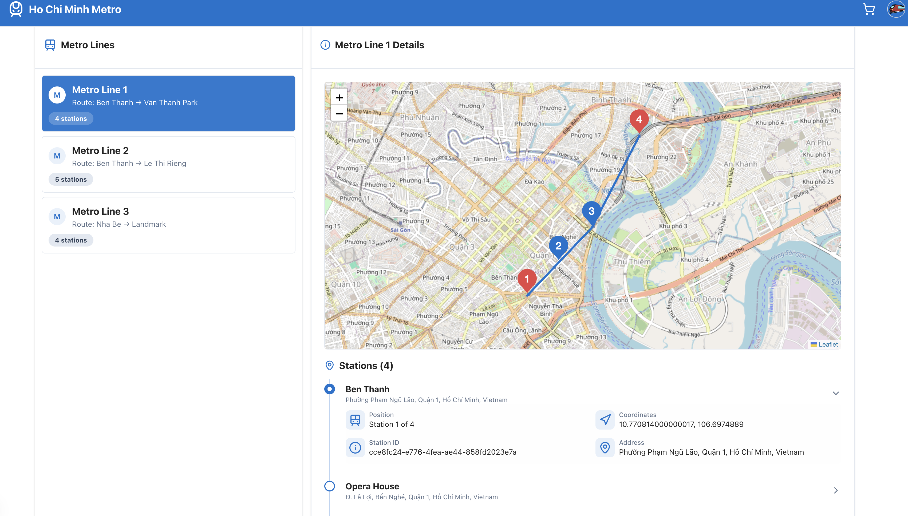

# PAWA Frontend

A modern, feature-rich web application built with Next.js 15, React 19, and TypeScript. This project implements a robust frontend solution with a focus on user experience, performance, and maintainability.

## 📸 Screenshots

<div align="center">
  
  <p><em>Landing Page - Welcome to HCMC Metroline</em></p>
  
  
  <p><em>Dashboard - Metroline Booking Center</em></p>
  
  
  <p><em>Metro Explorer - Interactive Map Interface</em></p>
</div>

## 🚀 Features

- **Modern Tech Stack**: Built with Next.js 15 and React 19
- **Type Safety**: Full TypeScript support
- **UI Components**: Comprehensive UI library using Radix UI primitives (Shadcn)
- **Styling**: Tailwind CSS for modern, responsive design
- **State Management**: Zustand for efficient state management
- **Form Handling**: React Hook Form with Zod validation
- **Real-time Features**: WebSocket integration with STOMP
- **Payment Processing**: Stripe integration
- **Maps Integration**: Leaflet for interactive maps
- **Data Visualization**: Recharts for beautiful charts and graphs
- **Animations**: Framer Motion for smooth animations

## 📋 Prerequisites

- Node.js (Latest LTS version recommended)
- pnpm (Package manager)
- Git

## 🛠️ Installation

1. Clone the repository:

```bash
git clone [your-repository-url]
cd pawa-fe
```

2. Install dependencies:

```bash
pnpm install
```

## 🚀 Development

To start the development server:

```bash
pnpm dev
```

The application will be available at [http://localhost:3000](http://localhost:3000).

## 📦 Available Scripts

- `pnpm dev` - Start development server
- `pnpm build` - Build for production
- `pnpm start` - Start production server
- `pnpm lint` - Run ESLint

## 🏗️ Project Structure

```
pawa-fe/
├── app/                   # Next.js app directory
│   ├── about/             # About page
│   ├── activation/        # Account activation
│   ├── auth/              # Authentication routes
│   ├── dashboard/         # Dashboard routes
│   ├── invoices/          # Invoice management
│   ├── metro-explorer/    # Metro map exploration
│   ├── my-tickets/        # User ticket management
│   ├── payment/           # Payment processing
│   ├── profile/           # User profile management
│   └── _components/       # Shared app components
├── components/            # Reusable components
├── lib/                   # Utility functions and configurations
├── public/                # Static assets
└── styles/                # Global styles
```

## 🛠️ Tech Stack

### Core

- Next.js 15.3.2
- React 19.1.0
- TypeScript
- Tailwind CSS

### UI Components

- Shadcn UI
- Lucide React (Icons)
- Framer Motion
- Tailwind CSS Animate

### State Management & Data Handling

- Zustand
- React Hook Form
- Zod
- Axios

### Real-time Features

- STOMP.js
- SockJS

### Payment Processing

- Stripe
- @stripe/react-stripe-js

### Maps & Visualization

- Leaflet
- Recharts

## 📚 Documentation

- [Next.js Documentation](https://nextjs.org/docs)
- [React Documentation](https://react.dev)
- [Tailwind CSS Documentation](https://tailwindcss.com/docs)
- [Shadcn Documentation](https://ui.shadcn.com/docs)

## 👥 Developers

This project is developed by a team of students from RMIT University, Saigon Campus.

| Student Name      | ID       | School             | Roles       |
| ----------------- | -------- | ------------------ | ----------- |
| Nguyen Son Tung   | s3979348 | RMIT Saigon Campus | Team Leader |
| Pavel Potemkin    | s3963284 | RMIT Saigon Campus |             |
| Nguyen Tuan Dung  | s3927511 | RMIT Saigon Campus |             |
| Phan Trong Nguyen | s3927189 | RMIT Saigon Campus |             |

## 🙏 Acknowledgments

- Next.js team for the amazing framework
- All contributors who have helped shape this project

### Notes

Please follow [Conventional Commits](https://www.conventionalcommits.org/en/v1.0.0/) specification while commit.
